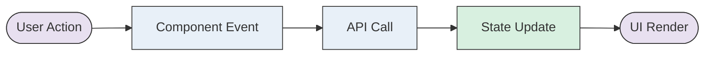

> Generated by [**TTADK**](https://bytedance.larkoffice.com/wiki/Gw0ewxEbHi1K0NkVd2YcNwvVnTg) (TikTok AI-Driven Development Kit) brainstorm command

## Involved Projects

| Project | Repository Path | Change Type |
| --- | --- | --- |
| [Project Name] | [Repository Path] | New/Modified |

---

## Functional Modules

### [Module Name]

#### Feature Overview

[One-sentence description of the module's functionality]

#### Page/Route Changes

| Change Type | Page | Route Path | Description |
| --- | --- | --- | --- |
| New Page | `PageName` | `/path/to/page` | [Feature description] |
| Modified Page | `PageName` | `/path/to/page` | [Change description] |

#### Component Changes

| Change Type | Component | File Path | Description |
| --- | --- | --- | --- |
| New Component | `ComponentName` | `src/components/xxx` | [Component purpose] |
| Modified Component | `ComponentName` | `src/components/xxx` | [Change description] |

#### API/Interface Changes

| Change Type | API Path | Method | Description |
| --- | --- | --- | --- |
| New Call | `/api/xxx` | POST | [API purpose] |
| Modified Call | `/api/xxx` | GET | [Change description] |

#### State Management Changes

| Change Type | Store/Model | Description |
| --- | --- | --- |
| New | `xxxStore` | [State purpose] |
| Modified | `xxxModel` | [Change description] |

#### Interaction Flow

---

## Risk Points

1. **[Risk Type]**: [Brief description]
