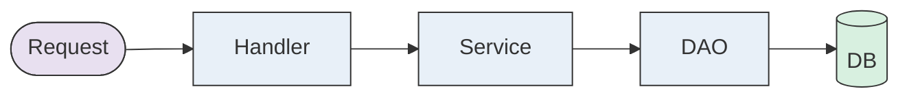

> Generated by [**TTADK**](https://bytedance.larkoffice.com/wiki/Gw0ewxEbHi1K0NkVd2YcNwvVnTg) (TikTok AI-Driven Development Kit) brainstorm command

## Involved Projects

| Service (PSM) | Project Path | Change Type |
| --- | --- | --- |
| [Service Name] | [Project Path] | New/Modified |

---

## Functional Modules

### [Module Name]

#### Feature Overview

[One-sentence description of the module's functionality]

#### IDL Changes

| Change Type | Object | Description |
| --- | --- | --- |
| New Method | `Service#Method` | [Feature description] |
| Modified Struct | `StructName` | New field `field_name` |

#### DB Changes

| Change Type | Table/Field | Description |
| --- | --- | --- |
| New Table | `table_name` | [Table purpose] |
| New Field | `table.field` | [Field purpose] |

#### Code Changes

| Change Type | File/Method | Description |
| --- | --- | --- |
| New | `handler/xxx.go#Handler` | API entry point |
| Modified | `service/xxx.go#Method` | Business logic |

#### Call Chain

---

## Risk Points

1. **[Risk Type]**: [Brief description]
