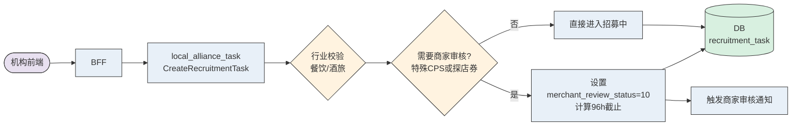
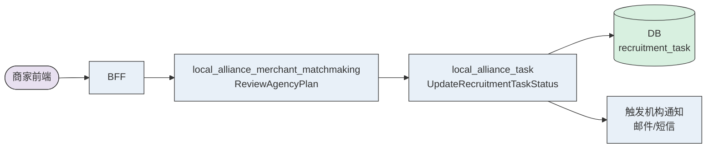
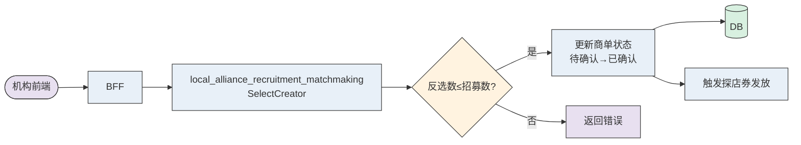

# TTADK Backend ERD 模板

> **使用时删除此内容！**
>
> **核心宗旨：如果这个 ERD 文档写完了给实习生，实习生能干好，那AI也可以干好！！**
>
> 本技术方案的核心目的不是还原全部实现细节，而是让 TTADK 能"准确理解你想让系统做什么，以及改哪里"。
>
> 因此，方案需要回答清楚三件事：
>
> 1. 这个功能在产品上要解决什么问题 / 达到什么行为变化**（功能点+重点子功能）**
> 2. 为了实现这个行为，系统中哪些能力需要调整**（影响服务/接口）**
> 3. 每个调整点"大概做什么事"，而不是"怎么一行行写代码" ，而对于明确的、主观判断的结论用准确的方式告诉AI（eg.在x接口中调用y服务z方法实现查询逻辑；在z方法中查询task_order数据表）
> 4. 后端用户需要自己完成方案设计，比如接口设计，TCC配置结构设计，RDS表设计等等。
>
> **【⚠️注意事项】**
>
> - 该文档最终会以Markdown形式下载到本地，避免使用太复杂的飞书文档组件，尽量将内容类型控制在以下范围
>   - 表格
>   - 文字
>   - 代码段
>   - 图片
>   - TCC 配置等
>
> 这里特别强调：
>
> 👉 **我们需要明确接口整体调用链路，提供必要信息避免明确部分产生偏离**

## 需求背景

为机构（Agency）提供高效的商单达人撮合工具，支持机构自主配置招募需求、选择达人、跟进履约、查看数据。本方案聚焦 **机构计划创编** 和**机构选择达人** 两大模块。

**设计原则**：复用现有招募计划（recruitment_task）能力，通过新增 task_type 区分机构场景，在现有 Action/Domain 中增加机构分支逻辑。未来统一为"派单系统"，区分商家、机构、平台运营不同使用方。

---

## 涉及工程

| 服务（PSM） | 工程路径 | 改动类型 |
|-------------|---------|---------|
| local_alliance_task | `services/local_alliance_task/` | 修改（招募计划创编/查询/更新扩展） |
| local_alliance_recruitment_matchmaking | `services/local_alliance_recruitment_matchmaking/` | 修改（达人反选/取消/批量添加扩展） |
| local_alliance_merchant_matchmaking | `services/local_alliance_merchant_matchmaking/` | 修改（新增商家审核机构计划） |

---

## 功能模块

### 模块 A：机构计划创编

#### 功能概述

支持机构按行业（餐饮/酒店/景点）创建招募计划，含基础信息、达人圈选（支持批量上传定向派单）、门店/POI圈选、CPS配置、探店券多时段配置、进行中计划编辑。

#### IDL 变更

| 变更类型 | 对象 | 说明 |
|---------|------|------|
| 修改结构体 | `CreateRecruitmentTaskRequest` | 新增 `industry` 枚举（Deal/ACC/TTD）、`agency_signed_creator_only` bool、`batch_upload_creator_mode` bool、`uploaded_creator_ids` list |
| 修改结构体 | `CreateRecruitmentTaskRequest.creator_requirement` | JSON结构内新增 `agency_signed_creator` 枚举（全部/仅签约达人） |
| 修改结构体 | `CreateRecruitmentTaskRequest.promotion_shop_info` | 新增 `batch_upload_shop_ids` 支持批量上传门店 |
| 修改结构体 | `ReceptionDateInfo` | 支持 `time_slots` list 多时段 + `excluded_dates` 不可探店日期 |
| 修改结构体 | `RecruitmentTaskDetail` | 新增 `industry`、`merchant_review_status`、`merchant_review_deadline` |
| 修改方法 | `UpdateRecruitmentTaskByTaskId` | 增加进行中状态可编辑字段白名单校验 |

#### DB 变更

| 变更类型 | 表/字段 | 说明 |
|---------|--------|------|
| 新增字段 | `recruitment_task.industry` | tinyint，行业类型（1-餐饮 2-酒店 3-景点） |
| 新增字段 | `recruitment_task.agency_signed_creator_only` | tinyint，是否仅限机构签约达人 |
| 新增字段 | `recruitment_task.merchant_review_status` | int，商家审核状态（0-无需审核 10-待审核 20-通过 30-拒绝） |
| 新增字段 | `recruitment_task.merchant_review_deadline` | datetime(3)，商家审核截止时间（提交时间+96h） |

#### 代码改动

| 改动类型 | 文件/方法 | 说明 |
|---------|----------|------|
| 修改 | `domain/recruitment_task/create_recruitment_task.go` | 行业差异化校验：餐饮支持特殊CPS+探店券；酒旅仅支持通用CPS+线下探店 |
| 修改 | `domain/recruitment_task/create_recruitment_task.go` | 商家审核判断：特殊CPS或探店券 → merchant_review_status=10 + 计算96h截止时间 |
| 修改 | `domain/recruitment_task/create_recruitment_task.go` | 批量上传达人校验：上限2000、达人存在性、两种模式互斥 |
| 修改 | `domain/recruitment_task/update_recruitment_task_by_task_id.go` | 进行中状态仅允许修改 video_publish_deadline（仅后延）和联系方式 |
| 修改 | `dal/recruitment_task/recruitment_task.go` | 扩展写入新字段 |
| 修改 | `pkg/convert/recruitment_task.go` | DTO ↔ Model 转换增加新字段 |
| 修改 | 门店圈选逻辑 | 餐饮基于商家选门店；酒旅直接圈选POI；批量上传上限3000 |
| 新增 | 投稿截止时间变更触达 | 编辑后触发达人端 Inbox/WA 通知 |

#### 调用链路

---

### 模块 B：商家审核机构计划

#### 功能概述

机构计划含特殊CPS或探店券时需商家审核，商家96h内通过/拒绝，超时自动取消。

#### IDL 变更

| 变更类型 | 对象 | 说明 |
|---------|------|------|
| 新增方法 | `MerchantMatchmaking#ReviewAgencyPlan` | 商家审核机构计划（通过/拒绝+原因） |
| 新增方法 | `MerchantMatchmaking#GetAgencyPlanList` | 商家端获取待审核机构计划列表 |

#### DB 变更

| 变更类型 | 表/字段 | 说明 |
|---------|--------|------|
| 无新增 | recruitment_task | 复用 A1 新增的 merchant_review_status / merchant_review_deadline 字段 |

#### 代码改动

| 改动类型 | 文件/方法 | 说明 |
|---------|----------|------|
| 新增 | `action/approval/review_agency_plan.go` | 商家审核入口 |
| 新增 | `domain/approval/review_agency_plan.go` | 审核逻辑：通过→更新状态进入招募中；拒绝→记录原因，机构可编辑重新提交 |
| 新增 | 定时任务 | 96h SLA 超时自动取消（复用现有定时任务基础设施） |
| 新增 | 触达逻辑 | 审核通过/拒绝 → 邮件/短信通知机构 |

#### 调用链路

---

### 模块 C：机构选择达人（反选）

#### 功能概述

机构在达人报名后即可反选，反选数不超过招募数；达人列表展示增强信息（履约率、合作次数等）；支持取消商单、批量添加达人。

#### IDL 变更

| 变更类型 | 对象 | 说明 |
|---------|------|------|
| 修改结构体 | `GetTaskOrderListResponse.CreatorInfo` | 新增 `historical_fulfillment_rate`、`collaboration_count`、`is_agency_signed`、`historical_vv`、`historical_gmv`、`historical_redemption_gmv` |
| 修改结构体 | `CancelCreatorTaskOrderRequest` | 新增 `cancel_reason` 字段 |

#### DB 变更

| 变更类型 | 表/字段 | 说明 |
|---------|--------|------|
| 无新增 | - | 复用现有表结构 |

#### 代码改动

| 改动类型 | 文件/方法 | 说明 |
|---------|----------|------|
| 修改 | `domain/task_order/select_creator.go` | 去除"等待招募截止后才能反选"校验，实现报名即反选 |
| 修改 | `domain/task_order/select_creator.go` | 增加机构反选数量上限校验：已反选数 ≤ 招募达人数 |
| 修改 | 获取达人列表 Domain | 聚合查询达人历史履约数据（RPC/ES）；新增筛选项和排序字段 |
| 修改 | `domain/task_order/cancel_creator_task_order.go` | 前置校验：已核销探店券或已投稿不可取消 |
| 新增 | 取消后触达 | 取消商单后触发达人端 Inbox/WA 通知 |
| 修改 | `action/creator/batch_add_creators_from_file.go` | 扩展校验：达人存在、未重复报名、投稿截止内、添加数≤剩余名额；返回失败文件 |

#### 调用链路

---

## 行业差异化逻辑汇总

| 维度 | 餐饮（Deal） | 酒店（ACC）/ 景点（TTD） |
|------|-------------|----------------------|
| POI圈选 | 选择商家 → 基于商家选门店 | 直接圈选POI |
| CPS | 支持「通用计划CPS」+ 「特殊佣金率」(1-80%) | 仅支持「通用计划CPS」 |
| 达人接待 | 支持「探店券」+「线下探店」 | 仅支持「线下探店」 |
| 商家审核 | 特殊CPS 或 探店券 → 需商家审核 | 无需商家审核 |

---

## 风险点

1. **分支逻辑复杂度**: 现有商家招募计划代码增加机构分支，需注意不影响商家原有流程，建议通过 TCC 开关灰度上线
2. **行业差异化覆盖**: 餐饮 vs 酒旅在 CPS/接待方式上有显著差异，需完善单元测试覆盖各行业×CPS类型×接待方式的组合场景
3. **商家审核SLA**: 96h 超时自动取消需要可靠的定时任务机制，需确认复用现有定时任务基础设施还是新建
4. **达人反选上限**: 机构反选数≤招募数的约束与商家端（无上限）不同，需防止并发场景下超选
5. **批量操作性能**: 达人批量上传2000、门店批量上传3000，需关注单次请求处理性能和超时问题
