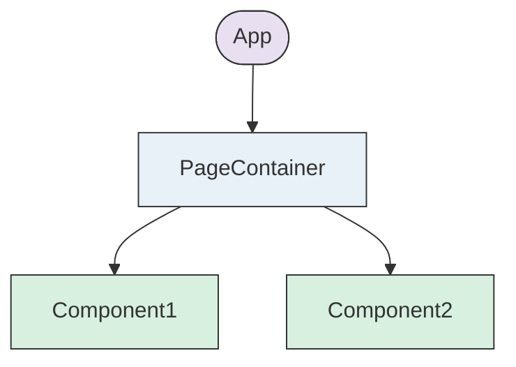
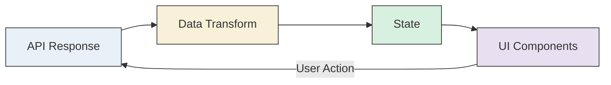

# Local Service FE 技术方案模板

> Generated by [**TTADK**](https://bytedance.larkoffice.com/wiki/Gw0ewxEbHi1K0NkVd2YcNwvVnTg) (TikTok AI-Driven Development Kit)

---

## Doc Naming Convention // 文档命名规范

eg: `[FE Tech] xxx-xxx`

---

## 1. Reference // 引用

[Required] List the context of the requirements (the following content is not all mandatory and can be adapted to your needs)

[必填] 罗列需求上下文（以下内容并非全部必填，可自行适配需求）

| If applicable | Links | POC |
|:--------------|:------|:----|
| Link to PRD | | PM |
| Link to Meego Ticket | | PM |
| Link to Figma/Demo | | Designer |
| Link to Starling | | Content Designer |
| Link to Event Tracking | | DA |
| Link to Test Case | | QA |
| Link to Legal Ticket | | Legal |
| Link to Libra | | PM |
| Git repo & feature branch | List all of the repo url & feature branch<br>Example: https://code.byted.org/ies/tiktok_web_monorepo - feature/ttlive_test | - |
| External Useful Links | Doc of Back end Tech solution & Back end IDL<br>Other doc of iOS or Android | - |

---

## 2. Background // 背景

[Required] Briefly describe the project background and the core problems to be solved. Describe the business domain, target users, and expected outcomes of the project.

[必填] 简要描述项目背景和需要解决的核心问题。描述项目的业务领域、目标用户、预期效果等。

---

## 3. Solutions // 技术方案

### 3.1 Architectural Design // 架构设计

[Optional] Architecture diagram, flowchart, and key technology selection of front-end systems or modules.

[可选] 前端系统或模块的架构图、流程图和关键技术选择。



### 3.2 Functional Module Division // 功能模块划分

[Required] List of functional modules and a brief description of each module.

[必填] 功能模块列表和每个模块的简要描述。

| Module // 模块 | UI | Requirement details // 需求细节 | Technical details // 技术细节 |
|:---------------|:---|:--------------------------------|:------------------------------|
| xxx | | | |
| xxx | | | |

### 3.3 Common Module // 公共模块

[Optional] If there are new encapsulated or modified general interactive components, public functions, etc., the interface and core logic of the components need to be designed.

[可选] 若有新封装或改动了通用交互组件、公共函数等，需对组件的接口和核心逻辑进行设计。

| Module // 模块 | Add/Modify/Remove // 增/改/删 | Scope of use // 使用范围 | Technical details // 技术细节 |
|:---------------|:------------------------------|:-------------------------|:------------------------------|
| | Add | | |
| | Modify | | |
| | Remove | | |

### 3.4 Tech Details // 技术细节

[Optional] A series of technical details such as data flow design, performance optimization, security considerations, version adaptation, end capability dependencies, external dependencies, etc:

- Describe the state management strategy (e.g., Redux, MobX, Jotai).
- Explain the front-end routing design and its relationship with different pages and components.
- Describe front-end data storage solutions, such as using LocalStorage, SessionStorage, or IndexedDB.
- Describe lazy loading, code splitting, and other optimization strategies.

[可选] 一系列诸如数据流设计、性能优化、安全性考虑、版本适配，端能力依赖，外部依赖等技术细节，如：

- 描述将使用的状态管理策略（如 Redux、MobX、Jotai 等）
- 说明前端路由设计及其与不同页面和组件的关系
- 描述前端的数据存储方案，如使用 LocalStorage、SessionStorage 或 IndexedDB 等
- 描述资源懒加载、代码拆分等优化方案

#### 3.4.1 State Management // 状态管理

```typescript
// Example: Jotai atom definition
import { atom } from 'jotai';

export const exampleAtom = atom<IExampleState>({
  loading: false,
  data: null,
});
```

#### 3.4.2 Data Flow // 数据流



#### 3.4.3 Core Hooks Design // 核心 Hooks 设计

[Optional] Document custom hooks with structured format: Purpose, Input, Output, Logic flow.

[可选] 使用结构化格式记录自定义 Hooks：目的、输入、输出、逻辑流程。

```typescript
// Purpose: [One-line description of what the hook does]
// Input: [Parameters the hook accepts]
// Output: [Return value structure (destructured object)]
// Logic: [Step-by-step flow with arrows (→) showing data transformation]
function useExampleHook(param: ParamType) {
  const [state, setState] = useState<StateType>(initialValue);

  useEffect(() => {
    // Side effect logic
  }, [dependencies]);

  const action = useCallback(() => {
    // Action implementation
  }, [dependencies]);

  return { state, action };
}
```

**Hook Documentation Structure**:
1. **Purpose**: One-line description of what the hook does
2. **Input**: Parameters the hook accepts
3. **Output**: Return value structure (destructured object)
4. **Logic**: Step-by-step flow with arrows (→) showing data transformation
5. **Pseudocode**: Simplified implementation showing key API calls and logic flow

#### 3.4.4 Core Component Design // 核心组件设计

[Optional] Document core components with structured format: Purpose, Input (Props), Output (JSX), Logic.

[可选] 使用结构化格式记录核心组件：目的、输入（Props）、输出（JSX）、逻辑。

```tsx
// Purpose: [One-line description of what the component renders]
// Input: [Props interface the component accepts]
// Output: [JSX structure description]
// Logic: [Key rendering logic and state handling]
function ExampleComponent(props: IExampleProps) {
  // State declarations
  const [localState, setLocalState] = useState(initialValue);

  // Event handlers
  const handleAction = () => {
    // Handler implementation
  };

  return (
    <div className="container">
      {/* Component JSX structure */}
    </div>
  );
}
```

**Component Documentation Structure**:
1. **Purpose**: One-line description of what the component renders
2. **Input**: Props interface the component accepts
3. **Output**: JSX structure description
4. **Logic**: Key rendering logic and state handling
5. **Pseudocode**: Simplified implementation showing core logic and return structure

### 3.5 Schema and Params // 页面 Schema 及传参

[Optional] C 端使用

[可选]

| Schema | Params // 传参 | Note // 备注 |
|:-------|:---------------|:-------------|
| JSON | JSON | |

### 3.6 Event Tracking // 埋点

[Required] Whether event tracking needed // 是否有埋点

| Doc link // 文档链接 | Implementation details (Optional) // 实现方案细节（可选） |
|:---------------------|:----------------------------------------------------------|
| No / Yes | |

### 3.7 Monitoring // 监控

[Optional]

[可选]

---

## 4. Schedule // 排期

[Required] Overall development schedule, providing explanations for modules with time risks, such as involvement of third-party dependencies, multi-person development, etc.

[必填] 整体的开发时间安排，对有时间风险的模块做说明，例如涉及第三方依赖、多人开发等

| 需求开发阶段：开发、联调 | PD // 估时 | Owner // 负责人 | Any risk // 风险说明 |
|:-------------------------|:-----------|:----------------|:--------------------|
| 模块&功能点1 | 3d | | |
| 模块&功能点2 | 2d | | |
| joint debugging // 联调 | 3d | | |

- **Total expected time (PD) // 总估时（PD）**:
- **Time of QA (Quality Assurance) testing // 测试排期**:
- **Expected release time // 预计发布时间**:

---

## 5. Risk Assessments // 风险评估

[Optional] All risk points must be evaluated one by one, and checked with Yes/No based on the actual situation.

[可选] 对所有风险点进行逐一评估，根据实际情况勾选 Yes/No

### 5.1 Business and Architecture // 业务和架构方面

| Check point // 检查点 | Changes // 改动点 | Action // 措施 |
|:----------------------|:------------------|:---------------|
| Code warehouse migration or Code directory migration // 代码仓库或目录迁移 | ☐ No ☐ Yes | List out the repository or directory before and after code migration, describe the migration target.<br>列出代码迁移前后的仓库或目录，描述迁移目标<br>All functions under this project do full regression.<br>本项目下所有功能做全量回归。 |
| Arch upgrades // 架构升级 | ☐ No ☐ Yes | List out the applications and modules involved in the architecture upgrade, describe the upgrade content and impact.<br>列出涉及架构升级的应用、模块，描述升级内容和影响 |
| Engineering upgrades // 工程升级<br>Pkg mgmt (npm/cli), webpack/builder, scripts/build config | ☐ No ☐ Yes | List the applications and modules involved in the engineering upgrade, describe the upgrade content and impact, and be cautious about the increased steps involved in building.<br>列出涉及工程升级的应用、模块，描述升级内容和影响。涉及构建步骤的提高警惕 |
| Incompatible change // 非兼容变更 | ☐ No ☐ Yes | List out the non-compatible upgrades, including interfaces, components, TCC configuration, etc., and describe the release notes.<br>列出非兼容升级的部分，包括接口、组件、tcc配置等，描述上线注意点 |

### 5.2 Dependence // 公共&外部依赖

| Check point // 检查点 | Changes // 改动点 | Action // 措施 |
|:----------------------|:------------------|:---------------|
| Front-end routing changes // 前端路由变更 | ☐ No ☐ Yes | List out all the changed page routes, such as addition, deletion, or migration.<br>列出所有变更的页面路由，如新增、删除或迁移 |
| Component tool library or business library change // 组件工具库/业务库变更 | ☐ No ☐ Yes | List all the changed component libraries/business libraries, describe the changes.<br>列出变更的组件工具库/业务库，描述变更内容 |
| New third-party package / package version change // 新增三方包/包版本变更 | ☐ No ☐ Yes | List all newly added or changed npm packages and their version changes.<br>列出新增或变更的npm包，以及版本变化 |

### 5.3 Other Config Change // 其他配置变更

| Check point // 检查点 | Changes // 改动点 | Action // 措施 |
|:----------------------|:------------------|:---------------|
| Goofy | ☐ No ☐ Yes | Boe link:<br>ppe/prod link: |
| TCC | ☐ No ☐ Yes | Boe link:<br>ppe/prod link: |
| Starling | ☐ No ☐ Yes | Link: |
| TLB | ☐ No ☐ Yes | |
| Libra | ☐ No ☐ Yes | Libra link:<br>放量与下线计划： |

---

## 6. Test Instruction // 测试说明

[Optional] Description of basic testing environment configuration, testing plan, key testing points, or links to relevant documents.

[可选] 基本测试环境配置、测试方案、重点测试点的说明，或相关文档链接。

---

## 7. Release Plan // 上线方案

[Optional]

[可选]

### 7.1 Libra A/B // 实验方案

### 7.2 Rollback // 回滚方案

---

## 8. Tech Review TODOs // 技术评审 TODOs

[Optional] Record pending issues in the requirement writing and TODO left in the review, and the form suggested here is a "task list".

[可选] 记录需求撰写中待问题、评审中遗留 TODO，建议形态是「任务列表」

- [ ] TODO 1
- [ ] TODO 2
